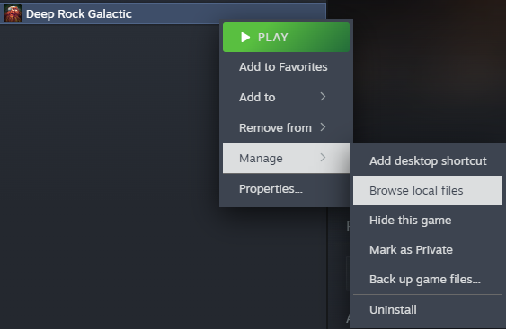
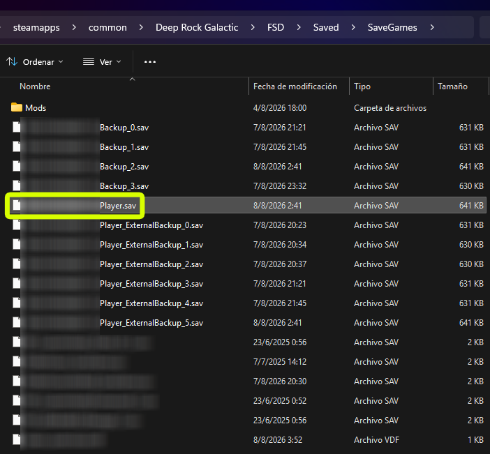
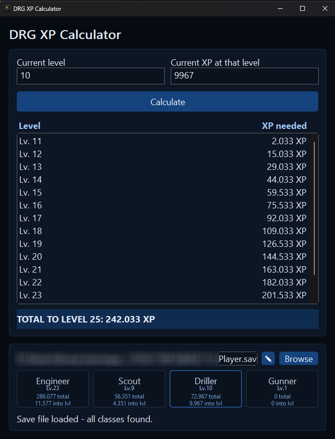
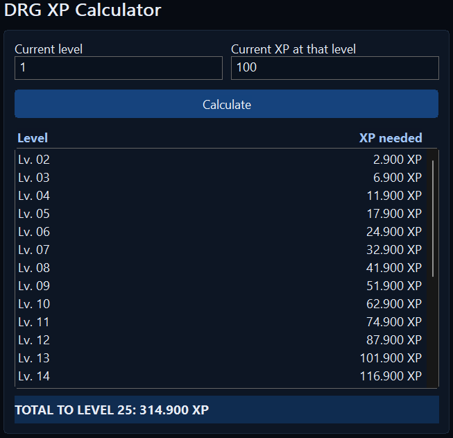

#  DRG XP Calculator

DRG XP Calculator is a small Windows desktop app for planning Deep Rock Galactic class leveling.

It supports two main workflows:

- manual XP calculation from a class level and current XP within that level
- save-file loading, so the app can read your current class progress directly from a DRG `.sav` file

## Quick Start

1. Download the executable from the [latest release](https://github.com/gandeladri/drg-xp-calculator/releases/latest).
2. Launch the app.
3. If your DRG save is in the default Steam location, the app will try to find and load it automatically.
4. If it does not load automatically, find your `.sav` file and select it with `Browse`.
5. Pick a class from the detected save data, or use the calculator manually.

## What It Does

Given a class level and current XP, the app calculates the XP required to reach each following level up to 25.

When a save file is loaded, the app can also:

- detect the four class progress values from the save
- let you switch between classes quickly
- remember the last save path
- try the default Steam save location automatically when no saved path is available
- refresh from the save automatically

## Save Auto-Detection

When the app starts, it first tries the last save path you used.

If no saved path is available, it checks the default Steam location for Deep Rock Galactic saves and tries to load the main player save automatically.

For many Steam installs, that means you may not need to browse for the `.sav` file manually at all.

## Find Your DRG Save File

If automatic detection does not find your save, or if your game is installed somewhere else, you can still locate the file manually.

If your game is installed through Steam, the easiest way to reach the correct save location is through the game's local files:

1. In Steam, right-click `Deep Rock Galactic`.
2. Open `Manage`.
3. Click `Browse local files`.

From the game folder, go to `FSD\Saved\SaveGames`.

Inside `SaveGames`, look for `<your_steam_id>_Player.sav`.

That is the file you usually want to load into DRG XP Calculator.

## Load a Save File in the App

If the save did not load automatically:

1. Open DRG XP Calculator.
2. Click `Browse`.
3. Select `<your_steam_id>_Player.sav`.
4. Use the class buttons to load the detected progress for Engineer, Scout, Driller, or Gunner.

The app remembers the selected path and can refresh from that same file later without asking again.

## Manual Calculation

1. Enter your current class level.
2. Enter your current XP within that level.
3. Click `Calculate`.

The result table shows the XP needed for each remaining level, and the total row shows the cumulative XP needed to reach level 25.

## Edit the Saved Path

If the save file moves, use the path edit controls in the save section to paste or type a new path and confirm it.

## Security & Privacy

- The app has no networking code. It never sends data anywhere.
- It reads only the `.sav` file you explicitly select, a previously saved path, or a save found in the default Steam location.
- The only file it writes is a small per-user cache holding the last-selected save path, at `%LOCALAPPDATA%\DrgXpCalculator\savepath.cfg`.
- While a save file is loaded, the app checks that file's last-modified time every 10 seconds and reloads it if it changed, so class progress stays in sync while you play. This is a local file check only — it makes no network calls and does not poll anything outside the one file you selected.
- The app does not use process injection, persistence (no registry/startup entries), or shell execution.
- Source is fully open in this repo; released binaries are built from that source, and file hashes are published with each release.

## License & Ownership

Copyright (c) 2026 Adrian Gandelman. Licensed under [MIT](LICENSE).

Original source: https://github.com/gandeladri/drg-xp-calculator
